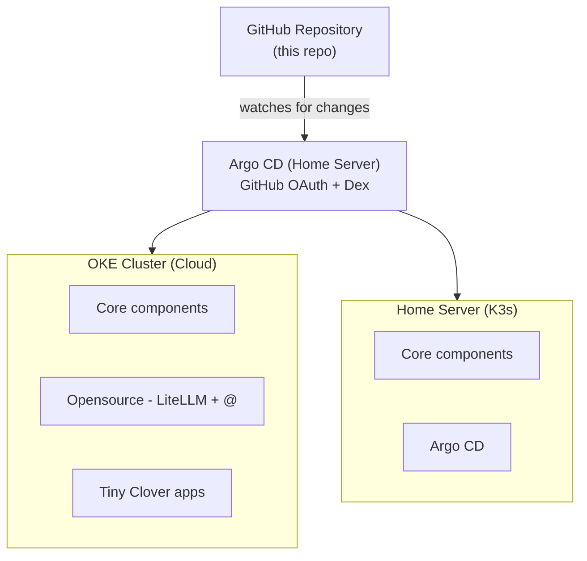

<p align="center">
  <a href="https://github.com/BeaverHouse/cicd">
    
  </a>

  <p align="center">
    Multi-arch Docker build + various K8s manifests to deploy hybrid cloud infrastructure
    <br>
    <br>
    <a href="https://github.com/BeaverHouse/cicd/issues">Bug Report</a>
    |
    <a href="https://github.com/BeaverHouse/cicd/issues">Request</a>
  </p>

  <p align="center">
    <a href="https://www.python.org/">
      
    </a>
    <a href="https://www.python.org/">
      
    </a>
    <a href="https://python-poetry.org/">
      
    </a>
    <a href="./LICENSE">
      
    </a>
  </p>
</p>

<!-- Content -->

<br>

## Overview

GitOps infrastructure repository for managing Kubernetes clusters with Argo CD.
Manages multiple clusters (OKE Cloud, Home Server) using a declarative, Git-driven approach.

## Architecture Overview



## Directory Structure

```
.
├── .github/workflows/     # GitHub Actions (multi-arch Docker build)
├── argocd/
│   ├── applications/      # Argo CD Applications (single-cluster)
│   └── applicationsets/   # Argo CD ApplicationSets (multi-cluster)
├── backend-template/      # Helm chart scaffold for backend services
├── charts/
│   ├── app-clustersecrets/  # Cluster-wide secret management
│   ├── app-jobs/            # Background jobs (CronJob, Job)
│   ├── app-tiny-clover/     # Application suite
│   ├── oss-argocd/          # Argo CD configuration
│   ├── oss-cert-manager/    # TLS certificate management
│   ├── oss-eso/             # External Secrets Operator
│   ├── oss-external-dns/    # Automatic DNS management
│   ├── oss-litellm/         # LLM proxy service
│   ├── oss-metallb/         # Bare-metal load balancer
│   ├── oss-metrics-server/  # Kubernetes metrics
│   └── oss-nginx-gateway/   # NGINX Gateway Fabric
├── docs/                  # Historical setup documentation
└── templates/             # Application templates
```

## Key Patterns

### GitOps with Argo CD

All deployments are managed declaratively through Argo CD using a combination of **Applications**, **ApplicationSets**, and the **App of Apps** pattern.  
See [argocd/README.md](argocd/README.md) for details.

### Secret Management

Secrets are never stored in Git. Instead:

1. Secrets are stored in a **third-party secret manager**
2. **External Secrets Operator** syncs them into Kubernetes via `ClusterSecretStore`
3. Each service declares needed secrets via `ExternalSecret` resources

### Networking Stack

- **Gateway API** (not legacy Ingress) with NGINX Gateway Fabric
- **cert-manager** for automatic TLS via Let's Encrypt DNS01 challenge (Route 53)
- **ExternalDNS** for automatic DNS record management in Route 53

### CI/CD Pipeline

GitHub Actions workflow (`docker-build.yml`) handles:

1. Multi-architecture Docker builds (AMD64 + ARM64)
2. Push to GHCR (`ghcr.io/beaverhouse/<repo>`)
3. Auto-update Helm values with new image tags
4. Argo CD detects the change and syncs automatically

## Quick Start

### Creating a New Backend Service

```bash
helm create charts/<chart-name> -p $PWD/backend-template
```

The [backend-template](backend-template/) provides:

- Dual port support (API + MCP)
- ExternalSecret integration
- Gateway API HTTPRoute
- HPA configuration

### Deployment Order (Bootstrap)

For a fresh cluster setup:

1. **Argo CD** (installed on operations cluster)
2. **External Secrets Operator** + secret provider token
3. **app-clustersecrets** (ClusterSecretStore + GHCR Secret)
4. **cert-manager** + ClusterIssuer
5. **NGINX Gateway Fabric** + Gateway API CRDs
6. **ExternalDNS** (if using Route 53 or other DNS provider)
7. **Metrics Server**
8. Application workloads

### Domains

| Domain             | Service                                              |
| ------------------ | ---------------------------------------------------- |
| `*.haulrest.me`    | Personal domain & services                           |
| `*.tinyclover.com` | Tiny Clover services, usually used as public product |
